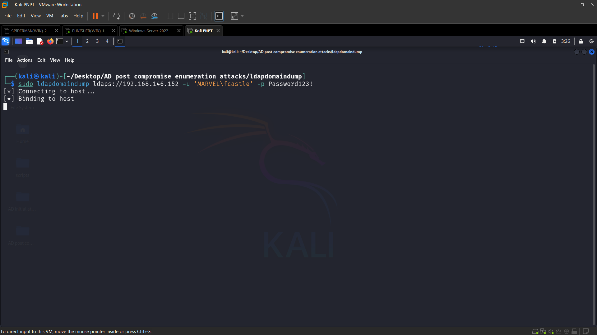
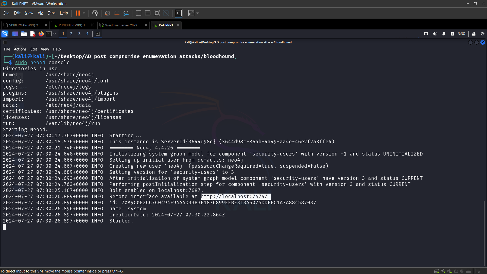
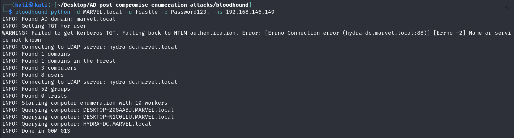
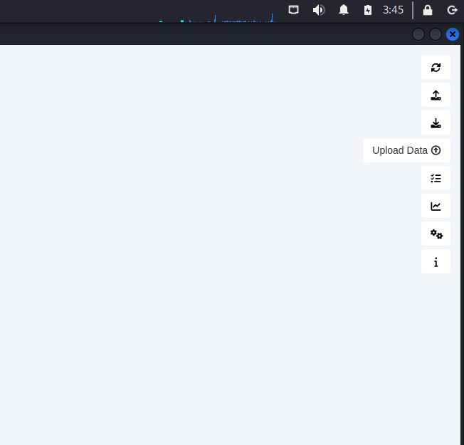

# Active Directory Post compromise enumeration

## LDAP domain dump

    sudo ldapdomaindump ldaps://192.168.146.152 -u 'MARVEL\fcastle' -p Password123!

## Bloodhound

    sudo pip install bloodhound
    
    sudo neo4j console
        Default pass neo4j neo4j
        
    Sudo bloodhound
    
    Run injester
    
    sudo bloodhound-python -d MARVEL.local -u fcastle -p Password123! -ns 192.168.146.149 -c all (domain controller ip)

## Plumhound

    Git : https://github.com/PlumHound/PlumHound.git
    
    Sudo pip3 install -r requirements.txt
    
    Bloodhound and neo4j should be running
    
    sudo python3 PlumHound.py --easy -p kali
    
    sudo python3 PlumHound.py -x tasks/default.tasks  -p kali
