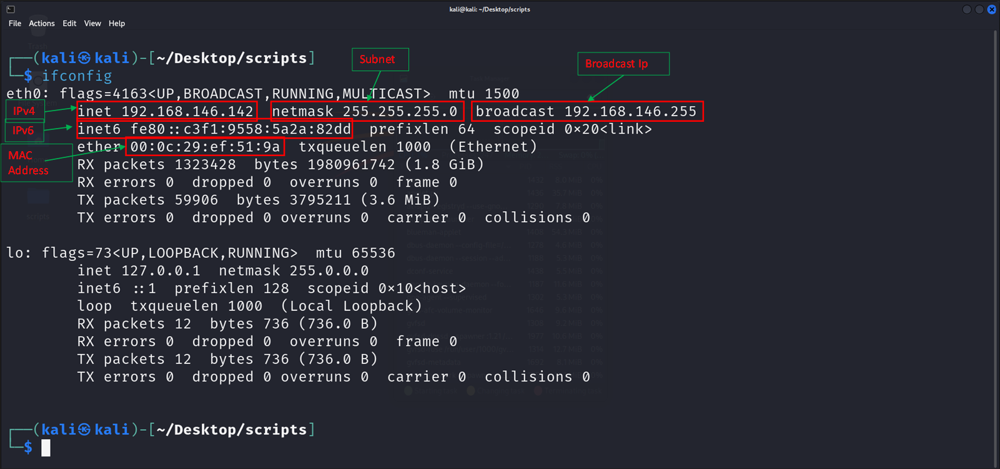

#Networking Refresher

**Private IPv4** - IP version 4 address
**IPv6 - IP version** 6 address

**MAC address** - Media Access control Address
**Netmask** - Subnetting Class
**Broadcast** - Broadcast IP address

**NAT** - Network Address Translation (NAT) is a service that enables private IP networks to use the internet and cloud. NAT translates private IP addresses in an internal network to a public IP address before packets are sent to an external network.

**TCP** - Transfer Control Protocol
    • A connection oriented Protocol
    • Based on the foundation of 3 way handshake
    • Examples - FTP, SSH

**UDP** - User Datagram Protocol 
    • A connection less protocol
    • Examples - Streaming Service, Gaming

